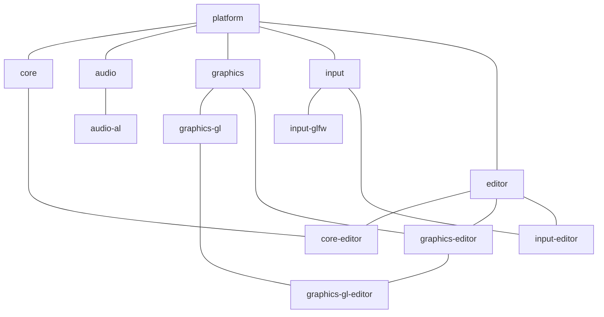

# 

An ECS game engine on the JVM.
Designed as a lightweight platform providing core concepts, and an assortment of modules implementing services and components - or otherwise extending functionality.

## Modules

* [platform](platform/README.md)
* [core](core/README.md)
* [audio](audio/README.md)
* [audio-al](audio/al/README.md)
* [graphics](graphics/README.md)
* [graphics-gl](graphics/gl/README.md)
* [input](input/README.md)
* [input-glfw](input/glfw/README.md)
* [editor](editor/README.md)
* [core-editor](core/editor/README.md)
* [graphics-editor](graphics/editor/README.md)
* [graphics-gl-editor](graphics/gl/editor/README.md)
* [input-editor](input/editor/README.md)

## Committing and Publishing

PRs tagged with the `major`, `minor`, or `patch` labels will publish a new release on merge to `master`.
