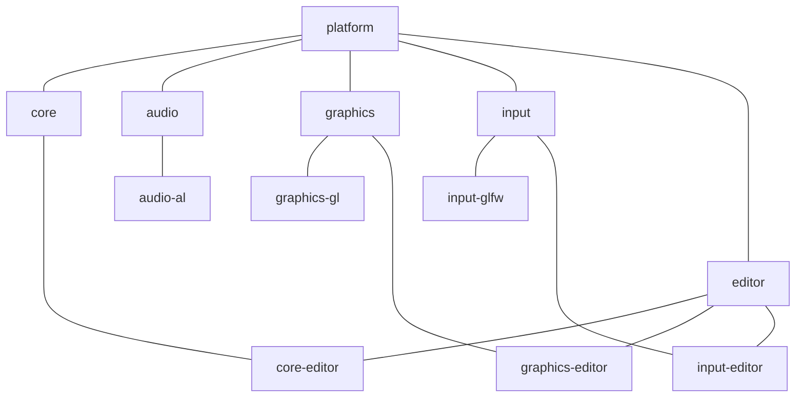

# 

An ECS game engine on the JVM.
Designed as a lightweight platform providing core concepts, and an assortment of modules implementing services and components - or otherwise extending functionality.

## Modules

* [platform](platform/README.md)
* [core](core/README.md)
* [audio](audio/README.md)
* [audio-al](audio/al/README.md)
* [graphics](graphics/README.md)
* [graphics-gl](graphics/gl/README.md)
* [input](input/README.md)
* [input-glfw](input/glfw/README.md)
* [editor](editor/README.md)
* [core-editor](core/editor/README.md)
* [graphics-editor](graphics/editor/README.md)
* [input-editor](input/editor/README.md)

```mermaid
flowchart TB
    platform --- core
    platform --- audio
    platform --- graphics
    platform --- input
    audio --- audio-al
    graphics --- graphics-gl
    input --- input-glfw
    platform --- editor
    editor --- core-editor
    editor --- graphics-editor
    editor --- input-editor
    core ----- core-editor
    graphics ----- graphics-editor
    input ----- input-editor
```

## Committing and Publishing

This project uses [Release Please](https://github.com/googleapis/release-please) with [Conventional Commits](https://www.conventionalcommits.org) to automate versioning and publishing on `master` merges.
