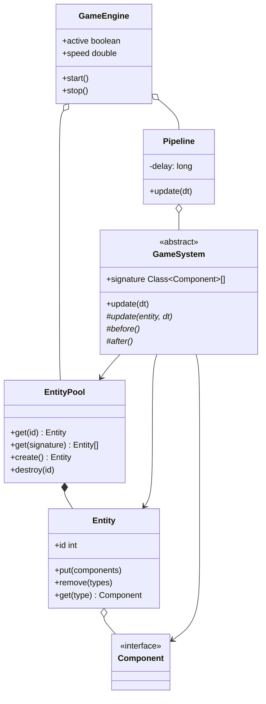
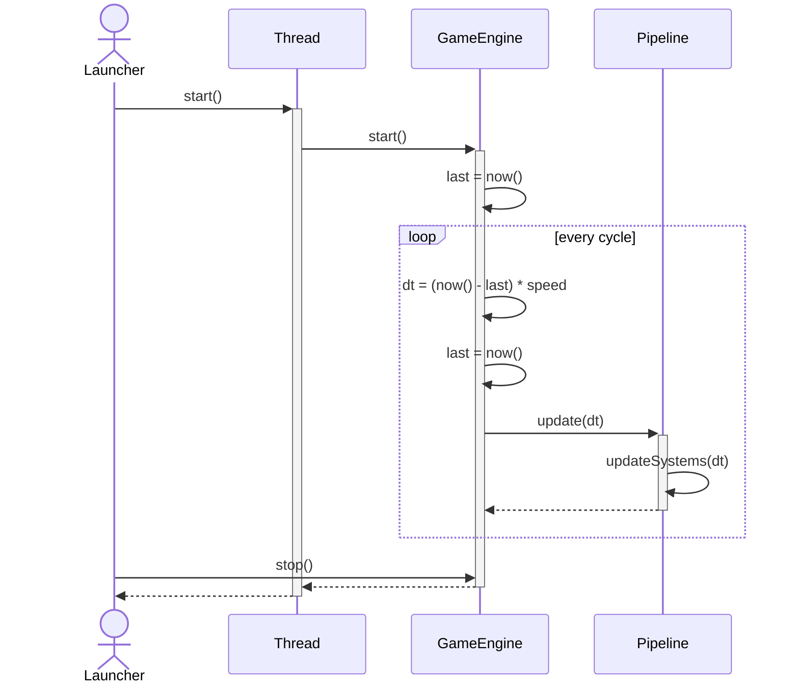
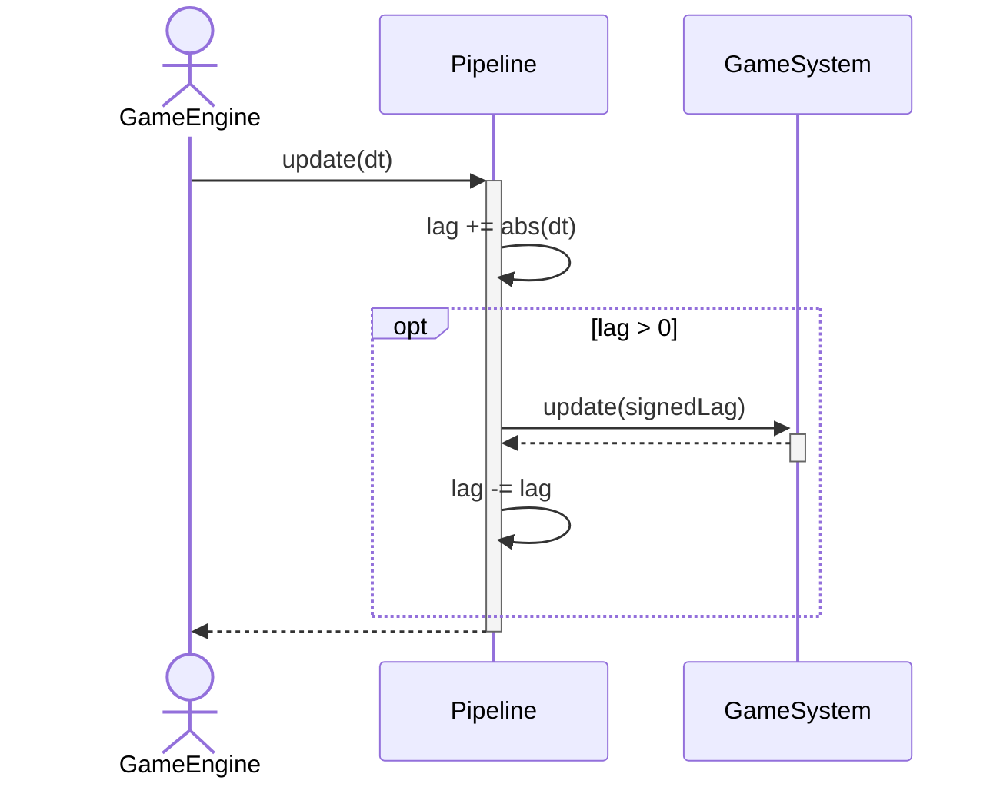
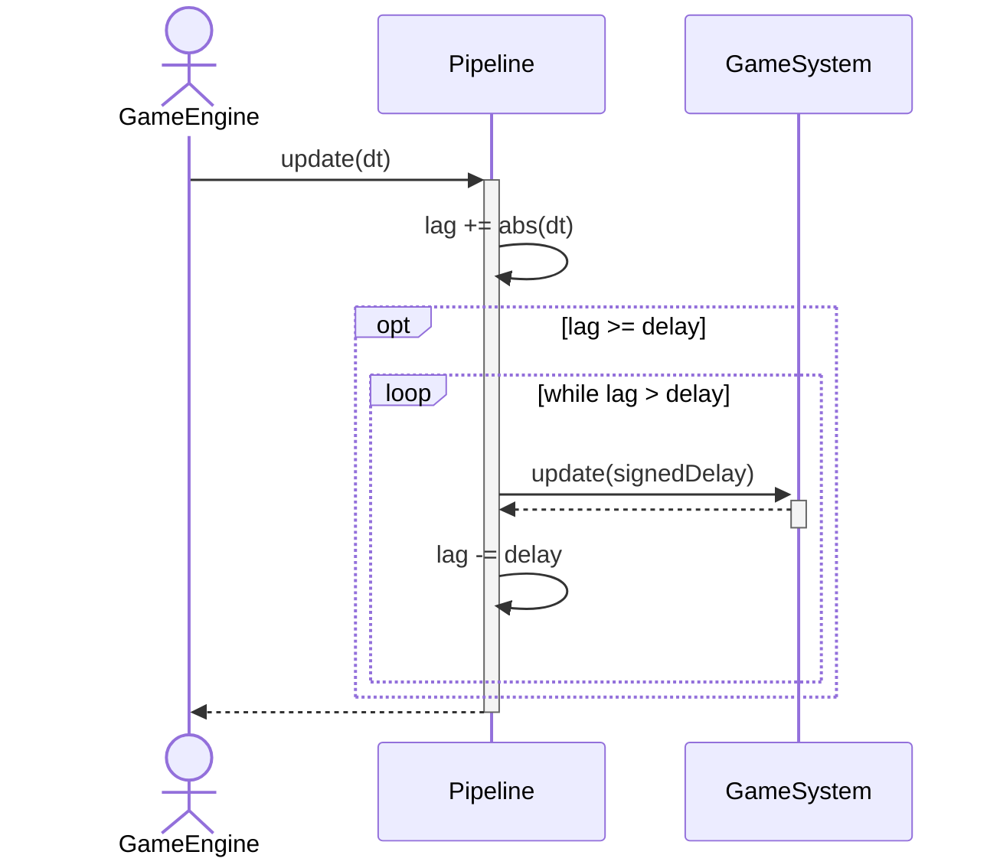
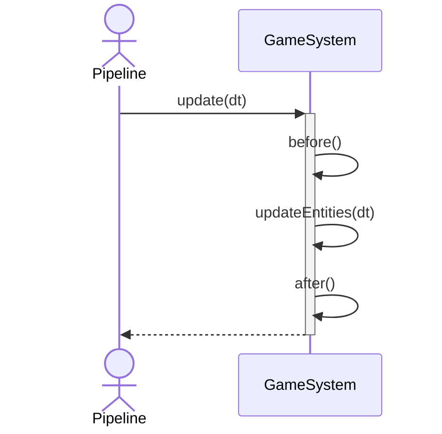

# platform

The bare-bones, most basic, foundational base of the engine.

Provides a few specialized, fundamental constructs:

* [`GameEngine`](src/main/java/dev/kkorolyov/pancake/platform/GameEngine.java) runs the simulation loop
* [`Pipeline`](src/main/java/dev/kkorolyov/pancake/platform/Pipeline.java) groups related systems into an atomically-updated unit
* [`GameSystem`](src/main/java/dev/kkorolyov/pancake/platform/GameSystem.java) executes specialized logic given relevant entities and their components
* [`EntityPool`](src/main/java/dev/kkorolyov/pancake/platform/entity/EntityPool.java) creates, destroys, and returns entities
* [`Entity`](src/main/java/dev/kkorolyov/pancake/platform/entity/Entity.java) provides a uniquely identifiable, mutable collection of components
* [`Component`](src/main/java/dev/kkorolyov/pancake/platform/entity/Component.java) contains specialized data



## GameEngine

A `GameEngine` instance serves as the heart of simulation flow and is instantiated with an ordered list of `Pipeline`s to execute.

Once started, an engine continuously loops on the current thread and for each cycle, updates each of its provided `Pipeline`s once.
_Update_ here means invoking `Pipeline#update` with the number of nanoseconds elapsed since the start of the preceding cycle multiplied by the engine's speed factor.
This update arg is commonly known as `dt` (or delta time).

Engine speed defaults to `1`, where simulation time is 1:1 with real time.
`< 1` gives a slower simulation time, whereas `> 1` gives a faster.
Speed can also be negative, to emulate rewind behavior in applicable systems.



## Pipeline

A `Pipeline` aggregates the set of `GameSystem`s that should be updated as a unit each cycle.

By default, a `Pipeline` updates all its systems once every time it is invoked (dynamic timestep update).



`Pipeline#withFrequency` configures a fixed interval to _always_ update downstream systems at (fixed timestep update).
Update `dt` is accumulated over successive cycles and systems are updated only once it has met or exceeded the `Pipeline`'s set frequency.
On the other hand, if accumulated `dt` is far greater than the fixed frequency - say in the event of a noticeable lag in the simulation - the `Pipeline` may run its update cycle multiple times with the same fixed timestep to catch up.



## GameSystem

The platform provides an abstract `GameSystem` class intended to house the majority of custom implementation.



## Entities

A `GameEngine` creates its own unique `EntityPool` which is shared with all attached `GameSystem`s.
The `EntityPool` supports creation, destruction, and locating of entities through `Component` signature.

---

# Loading resources

The [`Resources`](src/main/java/dev/kkorolyov/pancake/platform/Resources.java) class provides consistent mechanisms to opening streams to files.

`inStream` first tries to locate the file at the given path on the filesystem.
If not found, it tries to locate the file on the classpath.
If that also does not exist, it returns a `null` stream.
The rationale being that a Pancake application can ship with embedded default resources that can be replaced by the end-user without needing to repackage the entire application.

`outStream` simply opens an output stream to the given path on the filesystem.

---

# Usage

## Gradle

### Inline

`build.gradle(.kts)`

```kotlin
dependencies {
	implementation("dev.kkorolyov.pancake:platform:<pancake-version>")
}
```

### Version catalog

`gradle/libs.versions.toml`

```toml
[versions]
pancake = "<pancake-version>"

[libraries]
pancake-platform = { module = "dev.kkorolyov.pancake:platform", version.ref = "pancake" }
```

`build.gradle(.kts)`

```kotlin
dependencies {
	implementation(libs.pancake.platform)
}
```
