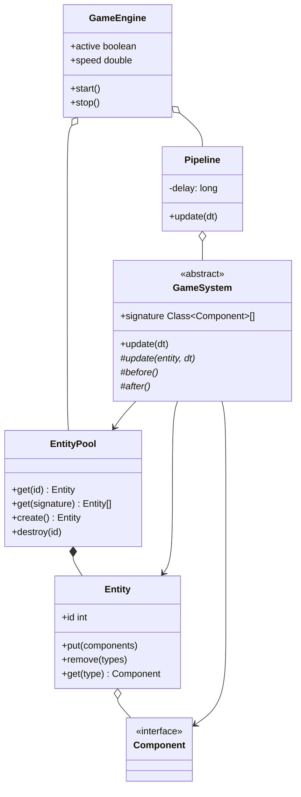
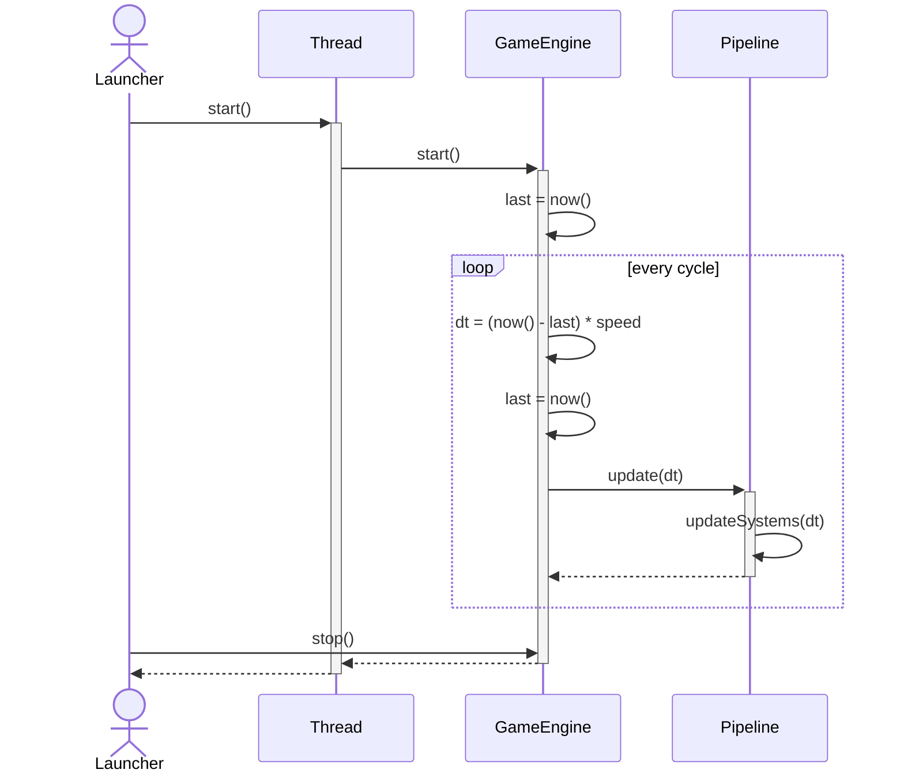
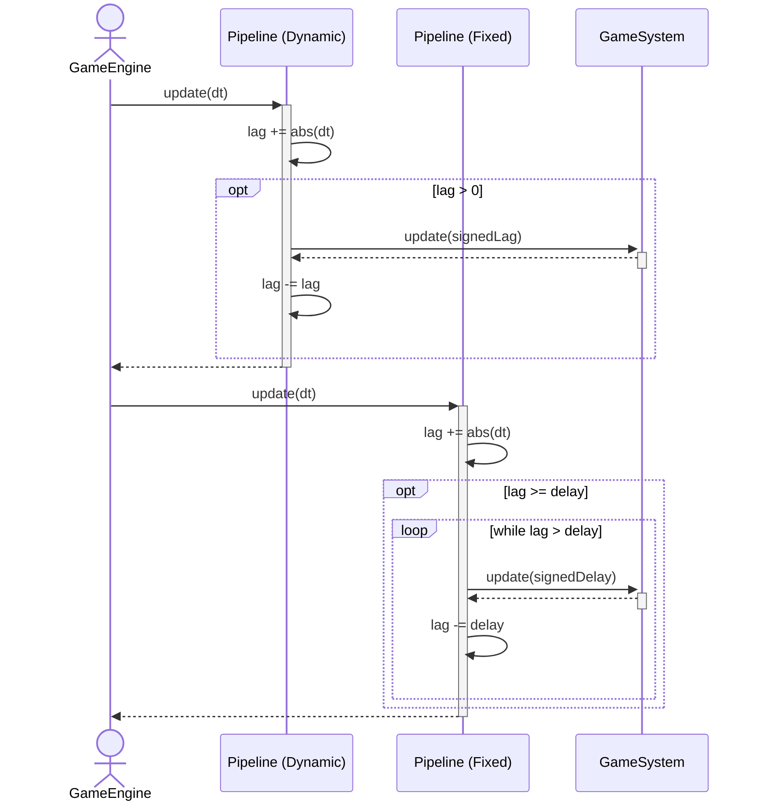
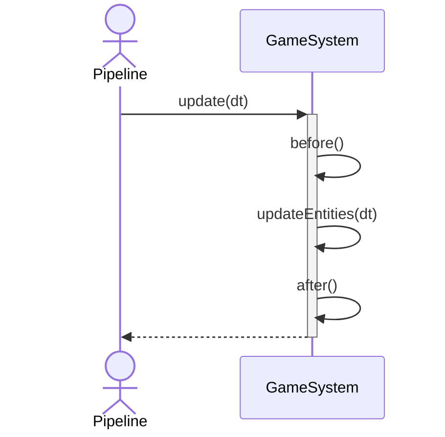

# Platform reference

## Architecture

```mermaid
classDiagram
	class GameEngine {
		+active boolean
		+speed double

		+start()
		+stop()
	}

	class Pipeline {
		-delay: long

		+update(dt)
	}

	class GameSystem {
		+signature Class~Component~[]

		+update(dt)

		#update(entity, dt)*
		#before()*
		#after()*
	}
	<<abstract>> GameSystem

	class EntityPool {
		+get(id) Entity
		+get(signature) Entity[]
		+create() Entity
		+destroy(id)
	}

	class Entity {
		+id int

		+put(components)
		+remove(types)
		+get(type) Component
	}

	class Component
	<<interface>> Component

	GameEngine o-- Pipeline
	GameEngine o-- EntityPool

	Pipeline o-- GameSystem

	EntityPool *-- Entity
	Entity o-- Component

	GameSystem --> EntityPool
	GameSystem --> Entity
	GameSystem --> Component
```

## `GameEngine` loop

```mermaid
sequenceDiagram
	actor L as Launcher
	participant T as Thread
	participant G as GameEngine
	participant P as Pipeline

	L->>+T: start()
	T->>+G: start()

	G->>G: last = now()

	loop every cycle
		G->>G: dt = (now() - last) * speed
		G->>G: last = now()
		G->>+P: update(dt)
		P->>P: updateSystems(dt)
		P-->>-G: 
	end

	L->>G: stop()
	G-->>-T: 
	T-->>-L: 
```

## `Pipeline` loop

```mermaid
sequenceDiagram
	actor E as GameEngine
	participant PD as Pipeline (Dynamic)
	participant PF as Pipeline (Fixed)
	participant S as GameSystem

	E->>+PD: update(dt)
	PD->>PD: lag += abs(dt)
	opt lag > 0
		PD->>+S: update(signedLag)
		S-->>-PD: 
		PD->>PD: lag -= lag
	end
	PD-->>-E: 
	
	E->>+PF: update(dt)
	PF->>PF: lag += abs(dt)
	opt lag >= delay
		loop while lag > delay
			PF->>+S: update(signedDelay)
			S-->>-PF: 
			PF->>PF: lag -= delay
		end
	end
	PF-->>-E: 
```

## `GameSystem` loop

```mermaid
sequenceDiagram
	actor P as Pipeline
	participant S as GameSystem
	
	P->>+S: update(dt)
	S->>S: before()
	S->>S: updateEntities(dt)
	S->>S: after()
	S-->>-P: 
```
